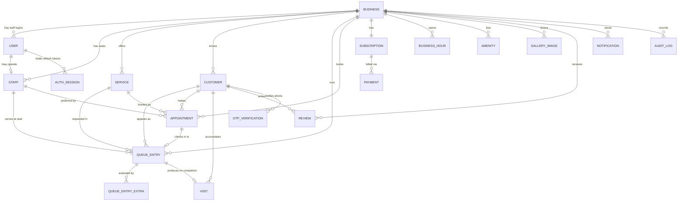

# 04 — Data Model

PostgreSQL 16. All tables carry a surrogate `id UUID DEFAULT gen_random_uuid()`, `created_at timestamptz DEFAULT now()`, and (where mutable) `updated_at timestamptz`. All tenant-owned tables carry `business_id` and are indexed on it. Money is stored as **integer paise** (`INT`/`BIGINT`), never floats.

---

## 1. Entity-relationship diagram



---

## 2. Enumerations

```
plan_type:            free | premium
subscription_status:  trialing | active | past_due | canceled
user_role:            owner | manager | staff
queue_status:         waiting | in_service | completed | no_show | cancelled
queue_source:         walk_in | online
appointment_status:   pending | confirmed | checked_in | completed | cancelled | no_show
appointment_source:   online | owner
color_token:          primary | secondary | amber500 | green500   -- from ServiceColorToken/StatusBadge
notification_channel: sms | email | push | in_app
notification_status:  queued | sent | delivered | failed
otp_purpose:          join_queue | booking | customer_login | owner_login | phone_verify
payment_status:       created | authorized | captured | failed | refunded
```

> **Status mapping from UI:** `serving` in `StatusBadge.tsx` is an alias of `in_service`; `upcoming` (appointments) maps to `pending`; `confirmed` stays. Canonicalize to the enums above; expose the display label from the API or client.

---

## 3. Tables

### 3.1 `business` (tenant root)
| Column | Type | Notes |
|---|---|---|
| id | uuid PK | |
| slug | citext UNIQUE | booking URL `tejotime.com/{slug}` (`QRSheet.tsx`) |
| name | text NOT NULL | "Sharp Cuts" |
| category | text | "Salon & Barber" |
| area | text | "Andheri West" |
| address | text | "Shop 4, Linking Road, Bandra West, Mumbai" |
| city | text | |
| description | text | About copy |
| established_year | int | 2014 |
| rating | numeric(2,1) | 4.9 (derived from reviews; cache) |
| review_count | int DEFAULT 0 | 212 |
| logo_url | text | |
| hero_image_url | text | |
| timezone | text DEFAULT 'Asia/Kolkata' | |
| currency | char(3) DEFAULT 'INR' | |
| token_prefix | text DEFAULT 'A' | ticket prefix ("A-24") |
| is_active | bool DEFAULT true | |

Indexes: `UNIQUE(slug)`.

### 3.2 `business_hour`
| Column | Type | Notes |
|---|---|---|
| id | uuid PK | |
| business_id | uuid FK → business | |
| day_of_week | int (0=Sun … 6=Sat) | |
| opens_at | time | null if closed |
| closes_at | time | |
| is_closed | bool DEFAULT false | Sunday "Closed" |

Constraint: `UNIQUE(business_id, day_of_week)`. Source: microsite hours table (`sharp-cuts/page.tsx`).

### 3.3 `amenity`
`id, business_id FK, label text, position int`. Source: `AMENITIES[]` ("Air conditioned", "Parking", …).

### 3.4 `gallery_image`
`id, business_id FK, url text, position int, alt text`. Source: `GALLERY[]`.

### 3.5 `user` (owner-app login accounts)
| Column | Type | Notes |
|---|---|---|
| id | uuid PK | |
| business_id | uuid FK → business | |
| handle | citext | login "sharpcuts" (`Login.tsx`, unique per platform) |
| email | citext | nullable |
| phone | text | E.164, nullable |
| password_hash | text | argon2id |
| role | user_role NOT NULL | owner/manager/staff |
| name | text | |
| dark_mode | bool DEFAULT false | `Settings.tsx` preference |
| last_login_at | timestamptz | |
| is_active | bool DEFAULT true | |

Indexes: `UNIQUE(handle)`, `INDEX(business_id)`.

### 3.6 `staff` (seats / service providers)
| Column | Type | Notes |
|---|---|---|
| id | uuid PK | |
| business_id | uuid FK → business | |
| user_id | uuid FK → user | nullable (a seat may not log in) |
| name | text NOT NULL | "John" |
| role_label | text | "Master barber", "Stylist · color" (microsite) |
| color_token | color_token | seat color (`Staff.color`) |
| accepts_walk_ins | bool DEFAULT true | |
| is_active | bool DEFAULT true | |
| position | int | display order |

Source: `staff[]` (`sample.ts`) + `BARBERS[]` (microsite).

### 3.7 `service`
| Column | Type | Notes |
|---|---|---|
| id | uuid PK | |
| business_id | uuid FK → business | |
| name | text NOT NULL | "Haircut & Beard" |
| duration_minutes | int NOT NULL | parsed from "45 min" |
| price_paise | int NOT NULL | ₹450 → 45000 |
| currency | char(3) DEFAULT 'INR' | |
| color_token | color_token | `Service.color` |
| is_active | bool DEFAULT true | |
| position | int | |

Source: `services[]` + `SERVICES[]`. Note microsite has extra services (Beard trim, Head massage, Kids haircut) — the canonical list is per-business and owner-managed.

### 3.8 `customer`
| Column | Type | Notes |
|---|---|---|
| id | uuid PK | |
| business_id | uuid FK → business | |
| name | text NOT NULL | |
| phone | text NOT NULL | E.164 ("+91 98201 12345" normalized) |
| email | citext | nullable |
| is_vip | bool DEFAULT false | `Customer.vip` |
| visits_count | int DEFAULT 0 | cached from `visit` |
| total_spend_paise | bigint DEFAULT 0 | cached |
| last_visit_at | timestamptz | drives "Last visit: 3d/Today/1w" |
| notes | text | marketing "notes" feature |
| created_at | timestamptz | ordering for "latest N" free-plan gating |

Constraint: `UNIQUE(business_id, phone)`. Indexes: `INDEX(business_id, created_at DESC)`, trigram index on `name`/`phone` for search (FR-E2).

### 3.9 `queue_entry` (the live queue + public tickets)
| Column | Type | Notes |
|---|---|---|
| id | uuid PK | |
| business_id | uuid FK → business | |
| customer_id | uuid FK → customer | nullable (quick walk-in may skip CRM) |
| customer_name | text NOT NULL | snapshot (`QueueEntry.name`) |
| customer_phone | text | snapshot |
| service_id | uuid FK → service | nullable |
| service_name | text | snapshot; may include add-ons ("Haircut + Shave") |
| staff_id | uuid FK → staff | seat; nullable until assigned |
| token | text | public "A-24" (unique per business per day) |
| status | queue_status NOT NULL DEFAULT 'waiting' | |
| source | queue_source NOT NULL | walk_in / online |
| position | int | order within seat's waiting list |
| extra_minutes | int DEFAULT 0 | `QueueEntry.extra` |
| base_wait_minutes | int DEFAULT 0 | seed `wait` (fallback estimate) |
| preferred_staff_id | uuid FK → staff | nullable (customer's chosen barber) |
| appointment_id | uuid FK → appointment | set when checked in from a booking |
| joined_at | timestamptz DEFAULT now() | drives "10:30 AM"/"Just now" |
| started_at | timestamptz | on start_service |
| completed_at | timestamptz | on checkout |
| notified_two_away_at | timestamptz | idempotency for "2 away" SMS |

Indexes: `INDEX(business_id, staff_id, status, position)`, `UNIQUE(business_id, token, joined_at::date)`, `INDEX(business_id, status)`.

### 3.10 `queue_entry_extra` (service add-ons)
`id, queue_entry_id FK, label text, minutes int, created_at`. Source: `DetailPanel.tsx` EXTRAS (Shave/Beard trim/Hair wash/Hair color). *(Alternative: store as JSONB on `queue_entry`; a table gives auditable pricing of add-ons.)*

### 3.11 `appointment`
| Column | Type | Notes |
|---|---|---|
| id | uuid PK | |
| business_id | uuid FK → business | |
| customer_id | uuid FK → customer | nullable |
| customer_name | text NOT NULL | snapshot |
| customer_phone | text | snapshot |
| service_id | uuid FK → service | |
| service_name | text | snapshot |
| staff_id | uuid FK → staff | preferred barber, nullable ("Any") |
| scheduled_start_at | timestamptz | booked slot start |
| scheduled_end_at | timestamptz | start + service duration |
| status | appointment_status DEFAULT 'pending' | upcoming→pending, confirmed |
| source | appointment_source | online / owner |
| queue_entry_id | uuid FK → queue_entry | set on check-in (FR-D2) |
| notes | text | |

Indexes: `INDEX(business_id, scheduled_start_at)`, `INDEX(business_id, status)`.

### 3.12 `visit` (completed-service ledger — powers CRM metrics & revenue)
| Column | Type | Notes |
|---|---|---|
| id | uuid PK | |
| business_id | uuid FK | |
| customer_id | uuid FK → customer | |
| queue_entry_id | uuid FK → queue_entry | |
| staff_id | uuid FK → staff | |
| service_name | text | |
| amount_paise | bigint | price + add-ons (revenue source) |
| completed_at | timestamptz | |

Created on `checkout`. Drives `customer.visits_count`, `total_spend`, `last_visit_at`, and the dashboard revenue KPI. *(Assumption — the mock only increments an in-memory `completed` counter; see [17](./17-assumptions-open-questions.md#business-logic--data).)*

### 3.13 `subscription`
| Column | Type | Notes |
|---|---|---|
| id | uuid PK | |
| business_id | uuid FK UNIQUE | one active plan per business |
| plan | plan_type DEFAULT 'free' | |
| status | subscription_status DEFAULT 'trialing' | "Free trial" copy |
| trial_ends_at | timestamptz | |
| current_period_start / _end | timestamptz | |
| provider | text | 'razorpay' / 'stripe' |
| provider_subscription_id | text | |

### 3.14 `payment`
`id, business_id FK, subscription_id FK, amount_paise, currency, status payment_status, provider, provider_payment_id, created_at`. Subscription billing (FR-G3).

### 3.15 `notification` (outbound log)
`id, business_id FK, customer_id FK (nullable), queue_entry_id FK (nullable), appointment_id FK (nullable), channel notification_channel, template text, to_address text, status notification_status, provider_message_id text, error text, scheduled_for timestamptz, sent_at timestamptz`. Powers reminders + "2 away" + owner alerts.

### 3.16 `otp_verification`
`id, business_id FK (nullable for owner), phone text, code_hash text, purpose otp_purpose, expires_at timestamptz, consumed_at timestamptz, attempts int DEFAULT 0, created_at`. Source: `OTPInput.tsx` + public join flow.

### 3.17 `auth_session` (refresh tokens)
`id, user_id FK, token_hash text, user_agent text, ip inet, expires_at timestamptz, revoked_at timestamptz, created_at`.

### 3.18 `audit_log`
`id, business_id FK, actor_user_id FK (nullable), actor_type text, action text, entity_type text, entity_id uuid, metadata jsonb, ip inet, created_at`. Every queue mutation, billing change, and admin impersonation.

### 3.19 (Optional) `daily_metric`
Pre-aggregated per business per day: `appointments_count, walkins_count, completed_count, revenue_paise, no_show_count`. Speeds dashboard KPIs (NFR-P5). Can be computed lazily instead.

---

## 4. Key relationships & cardinalities

- **business 1—N** users, staff, services, customers, queue_entries, appointments, business_hours, amenities, gallery_images, reviews, notifications; **1—1** subscription.
- **staff N—1 business**; optionally **1—1 user** (a barber who also logs in).
- **queue_entry N—1 business**, N—1 staff (seat), N—1 service, N—1 customer (nullable); **1—N** queue_entry_extra; **1—0..1** visit (on completion); optionally **0..1** back to appointment.
- **appointment 0..1 → queue_entry**: check-in links them (FR-D2).
- **customer 1—N** queue_entries, appointments, visits, reviews.
- **subscription 1—N** payments.

## 5. Invariants & constraints (enforced in DB + service layer)

1. At most **one `in_service`** queue entry per `(business_id, staff_id)` at a time (partial unique index or serialized command). Reflects one chair, one customer.
2. `position` is contiguous within `(business_id, staff_id, status='waiting')`; recomputed on every mutation.
3. `token` unique within `(business_id, date(joined_at))`.
4. `customer.phone` unique within `business_id`.
5. `visit.amount_paise` = service price + Σ add-on prices at completion time.
6. Money columns are non-negative integers.
7. Soft-delete via `is_active` on business/staff/service/user; hard-delete only via privacy/erasure jobs.

## 6. Notes on snapshots

Queue/appointment rows store **snapshot** copies of customer name/phone and service name because: (a) the mock keeps these as plain strings on the entry, (b) service names mutate at runtime via add-ons ("Haircut + Shave"), and (c) historical accuracy (a later price change must not rewrite a past visit). The `*_id` FKs remain the source of truth for joins; snapshots are for display and history.
